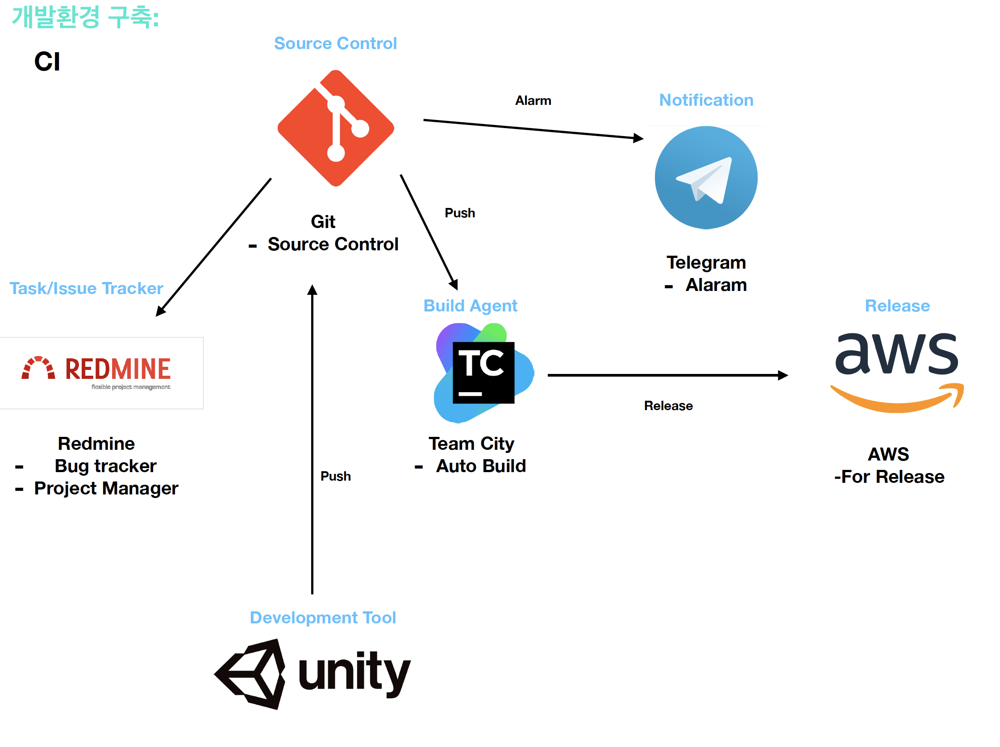
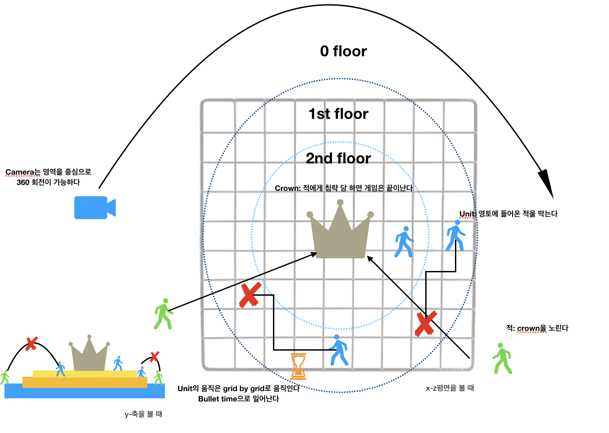
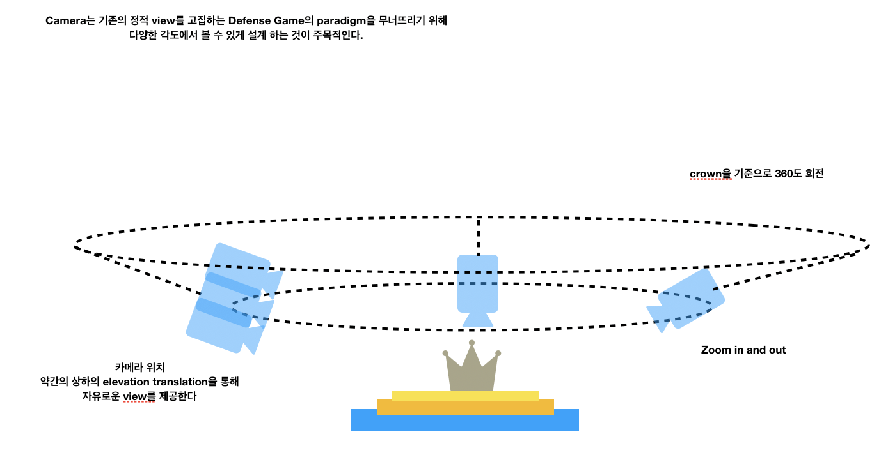
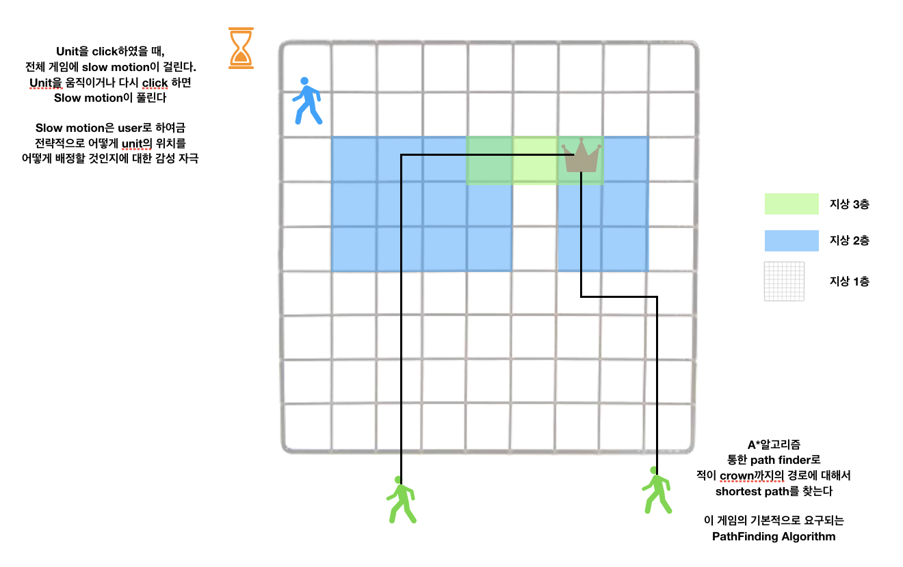

## Dev Environment

### [CI Developemnt](<https://aws.amazon.com/ko/devops/continuous-integration/>) 

* Issue Tracker: Redmine

* Source Control : Git or Bit Bucket
* Build: Team City or Travis or Jenkins
* Staging(Unity test): Not yet
* Production(Release): AWS

* Notification: telegram

* Development Tool: Unity

### 3-D Modeling Tool (If possible…..)

* Maya

### DB

*  Firebase
*  Excel datasheet

##  Implementation Plan

1.  Prototype

2. Camera

3. Function

